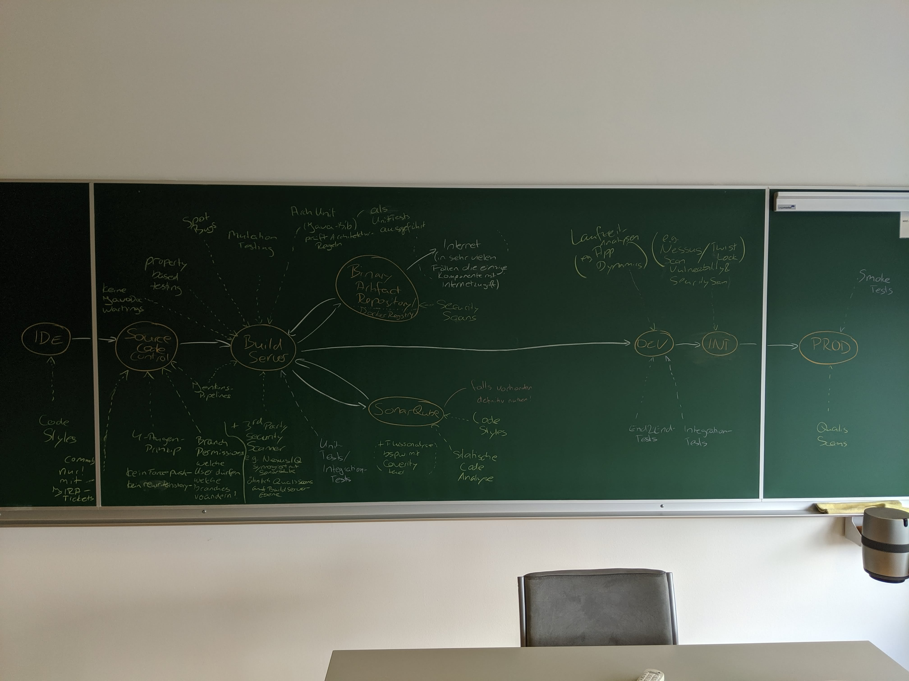

# Which Quality Gates do you see in an CI/CD-Pipeline?

The session was hosted by Uinonah. We collected all the - in our humble opinion - necessary and recommended components in a CI/CD pipeline.

Some of the mentioned frameworks are specific to Java, but have equivalents in other languages.

